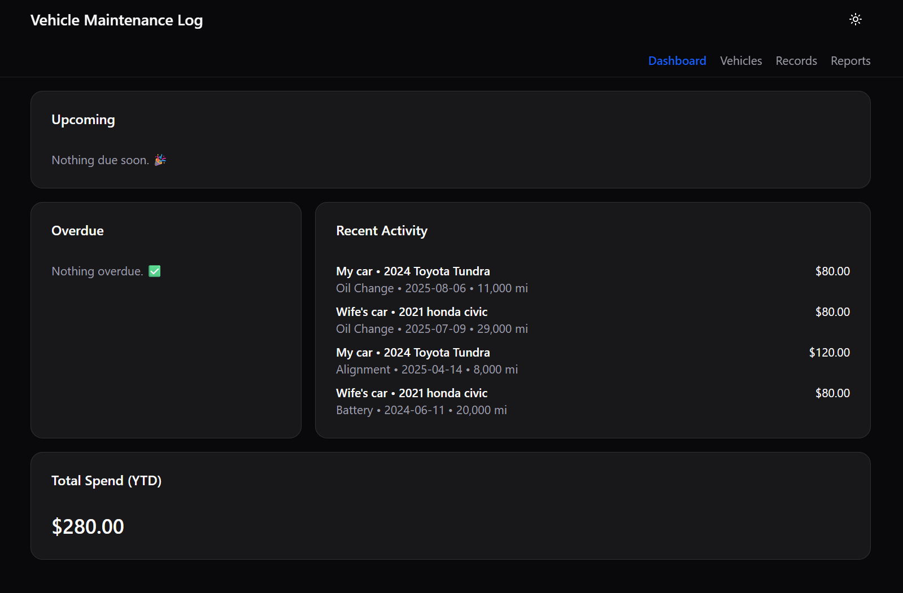
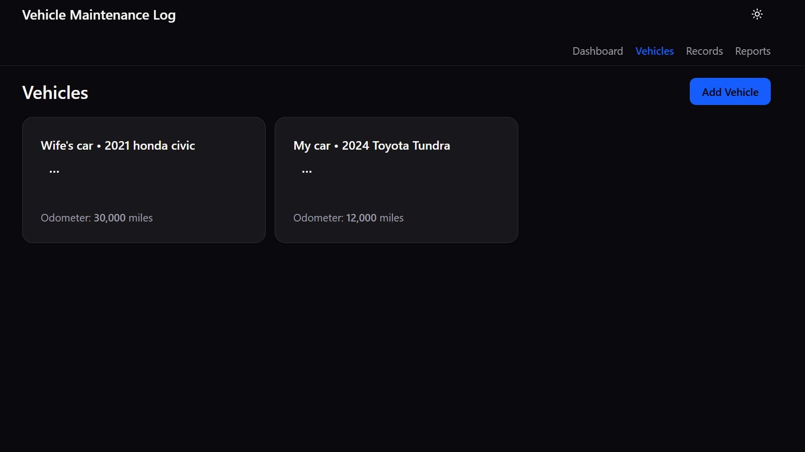
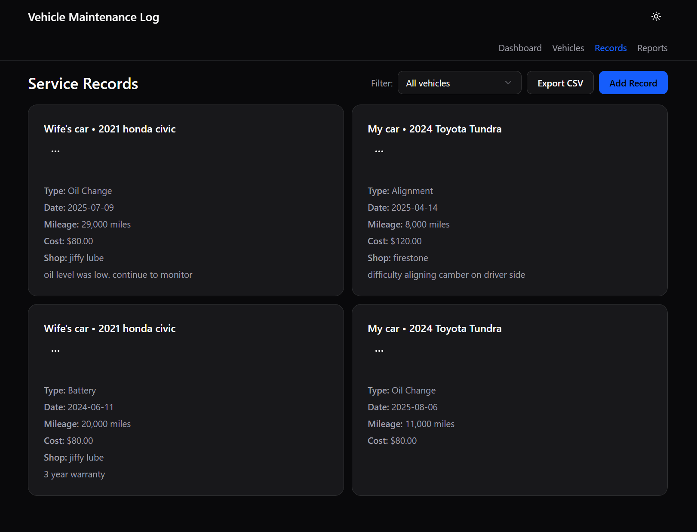
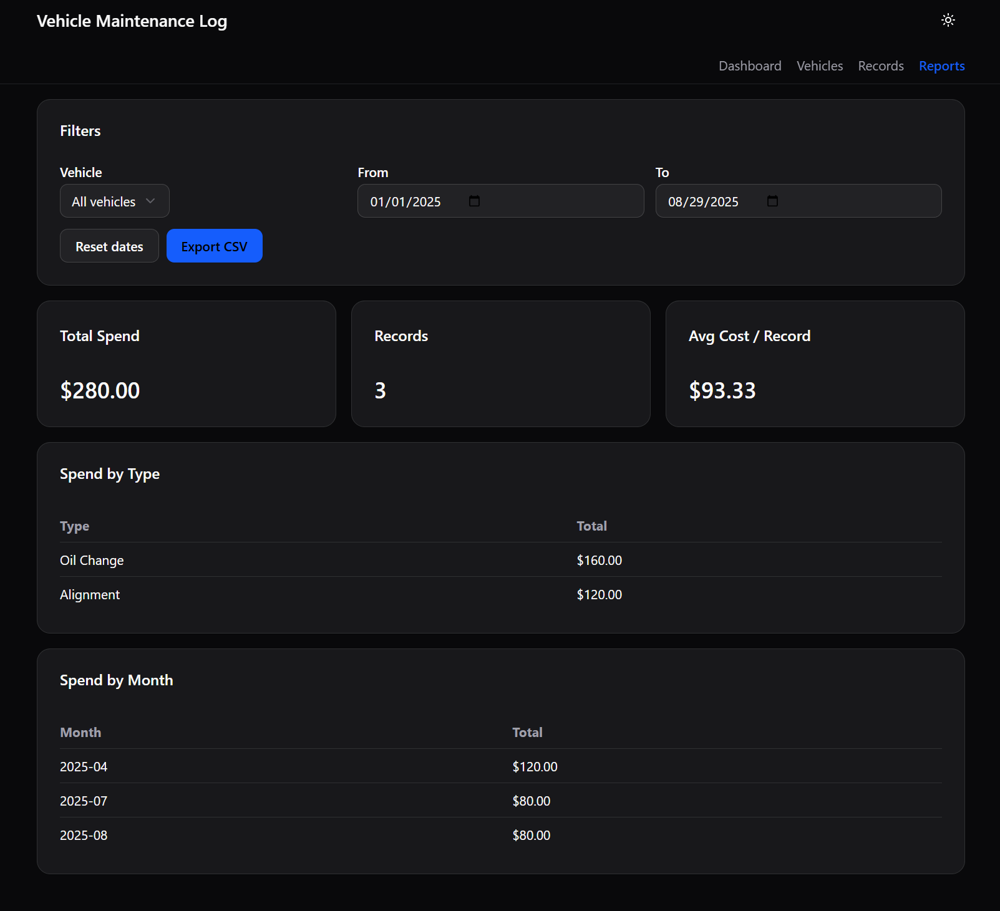

# 🚗 Vehicle Maintenance Log

A React + Vite + Tailwind + shadcn/ui application for tracking vehicle service history.  
Users can manage vehicles, log service records, track upcoming maintenance, export reports, and install the app as a PWA.

---

## ✨ Features
- **Dashboard** – view upcoming/overdue maintenance, recent activity, and year-to-date spend  
- **Vehicles** – add/edit/delete vehicles with nickname, make, model, year, and mileage  
- **Service Records** – log service type, date, mileage, cost, shop, and notes  
- **Reports** – filter by vehicle & date range, KPIs (total spend, records, avg cost), CSV export  
- **Vehicle Detail** – per-vehicle history and metrics  
- **LocalStorage Persistence** – data survives refresh without a backend  
- **Responsive UI** – optimized layouts for mobile (bottom nav) and desktop (top nav)  
- **Theming** – light/dark mode toggle with shadcn/ui design tokens  

---

## 🛠️ Tech Stack
- **React 18** with **Vite** (fast dev/build tooling)  
- **TypeScript** (static typing & maintainability)  
- **Tailwind CSS v4** for utility-first styling  
- **shadcn/ui** for accessible, pre-built UI components  
- **Lucide Icons** for crisp icons  
- **LocalStorage** for client-side persistence  

---

## 📸 Screenshots

### Dashboard


### Vehicles Page


### Records Page


### Reports page


---

## 🚀 Getting Started

### 1. Clone & install
```bash
git clone https://github.com/mattmach1/vehicle-maintenance-log.git
cd vehicle-maintenance-log
npm install
npm run dev